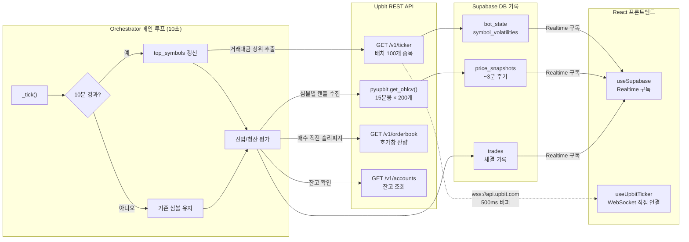

# API 연동 규격서 (API Integration)

## 1. 업비트 (Upbit) API
- **필요 권한:** 자산 조회, 주문 조회, 주문하기 (입출금 권한 제외 권장).
- **인증 방식:** Access Key, Secret Key를 이용한 JWT 토큰 인증.
- **주요 Endpoint:**
    - `GET /v1/accounts` (잔고 확인)
    - `POST /v1/orders` (주문 생성)
### 1.1. 데이터 수집 및 분석 (Collector)
- **주요 기능:**
    - `get_orderbook(symbol)`: 현재 호가창 데이터를 수집.
    - `estimate_slippage(symbol, side, amount_krw)`: 특정 금액을 시장가로 주문했을 때의 예상 슬리피지를 계산.
- **슬리피지 계산 알고리즘 (Walk-the-book):**
    1. 호가창의 매수/매도 잔량을 가격 순으로 정렬.
    2. 주문 금액(`amount_krw`)이 모두 소진될 때까지 각 호가의 잔량을 차례대로 차감.
    3. 최종적으로 체결된 평균 가격과 현재 최우선 호가(Best Bid/Ask) 간의 차이를 슬리피지로 산출.
- **예외 처리:** API 오류 또는 데이터 수집 실패 시, 시스템 중단을 방지하기 위해 슬리피지를 0.0으로 반환(Fail-open)하고 로그를 기록.

### 1.2. 데이터 수집 흐름도

Orchestrator의 메인 루프(10초)에서 주기적으로 호출되는 데이터 수집 과정을 보여줍니다.

## 2. 슈파베이스 (Supabase) DB
- **연동 방식:** `supabase-py` 라이브러리 활용.
- **주요 테이블 구조:**
    - `trades`: id, symbol, side, price, volume, fee, slippage, created_at
    - `daily_stats`: date, total_balance, profit_loss

## 3. 카카오톡 알림 (KakaoTalk API)
- **방식:** 카카오톡 메시지 API (나에게 보내기) 활용.
- **인증:** 카카오 개발자 센터의 REST API 키 및 OAuth2.0 Access Token 필요.
- **알림 템플릿:** - [매수 알림] {종목명} | 가격: {가격} | 비중: {비중}%
    - [매도 알림] {종목명} | 수익률: {수익률}% | 손익: {금액}