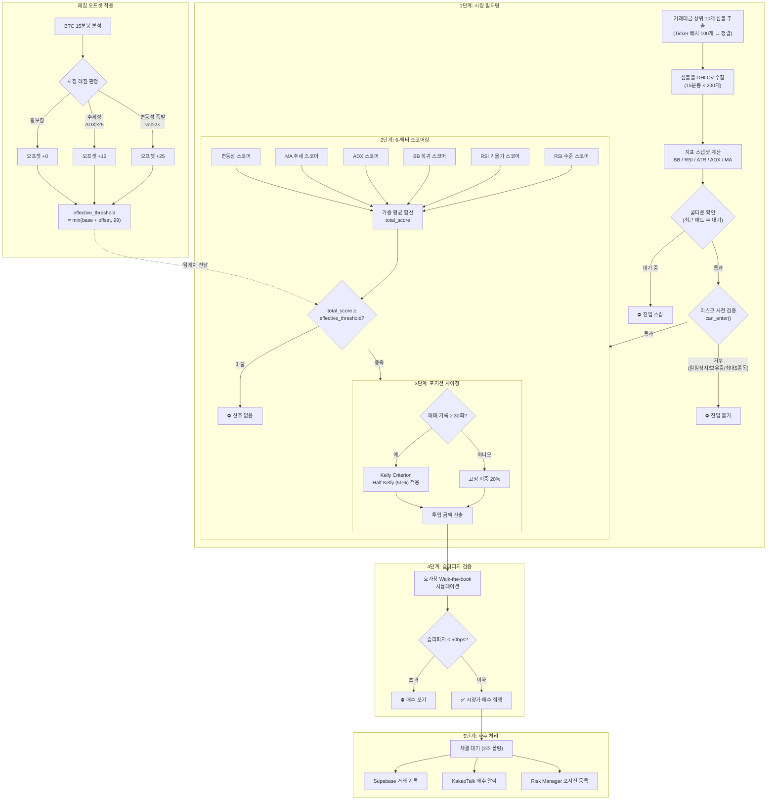
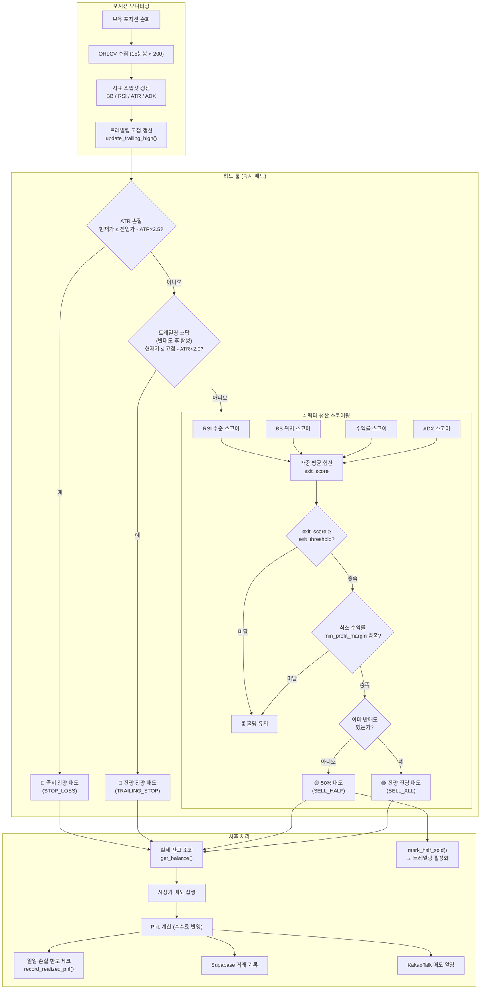

## 핵심 매매 전략: 확증 기반 변동성 조절형 평균 회귀

본 전략은 가격이 통계적 정상 범위를 벗어났을 때 평균으로 회귀하려는 성질을 이용하되, 추세가 완전히 무너지는 상황을 회피하기 위해 '진입 확증'과 '동적 위험 관리'를 결합한 알고리즘입니다.

---

## 1. 진입 알고리즘 (Entry Logic)

가격이 단순히 낮아졌다고 매수하는 것이 아니라, 하락세가 멈추고 반등의 에너지가 모이는 시점을 포착합니다. 기존의 엄격한 필터 방식(AND-gate) 대신, 여러 지표의 상태를 점수화하여 종합적으로 판단하는 **스코어링 시스템**을 사용합니다.

### 1단계: 시장 필터링 (폭풍 전야 감지)

* **거래 대금 상위 추출:** 유동성이 부족한 종목에서 발생하는 가격 왜곡을 피하기 위해 업비트 거래 대금 상위 10개 종목으로 대상을 제한합니다.
* **변동성 과부하 계산:** 최근 4시간의 변동성이 과거 ~2일 평균보다 2배 이상 높을 경우, 시장이 비정상적인 공포 상태라고 판단하여 진입 임계치를 동적으로 높여 더 강한 신호만 통과시킵니다. 이는 파도가 너무 높을 때 배를 띄우지 않는 것과 같습니다. (15분봉 기준: 단기 16캔들 / 장기 192캔들)
* **하이브리드 레짐 오프셋:** 시장이 추세장(ADX ≥ 25)이면 진입 임계치를 +15점, 변동성 폭발(변동성 ≥ 2배)이면 +25점 높여 더 확실한 기회만 포착합니다. 횡보장에서는 원래 임계치를 그대로 사용합니다. effective threshold의 상한은 99점으로 제한됩니다.

### 2단계: 매수 신호 포착 (스코어링 시스템)

진입 신호는 6가지 세부 필터의 점수를 가중 합산하여 결정됩니다. 각 필터는 0~100점 사이의 점수를 산출하며, 최종 합산 점수가 사용자가 설정한 **진입 임계치(Threshold)** 이상일 때 매수 신호가 발생합니다.

#### 스코어링 산출 공식
| 필터 | 100점 (유리) | 0점 (불리) | 스코어 공식 | 가중치 변수 |
|------|-------------|-----------|------------|------------|
| 변동성 | vol_ratio ≤ 1.0 | vol_ratio ≥ 3.0 | `max(0, min(100, (3.0 - ratio) / 2.0 * 100))` | `w_volatility` |
| MA 추세 | MA20 > MA50 | MA20 < MA50 | 상승=100, 하락=0, 데이터부족=50 | `w_ma_trend` |
| ADX | ADX ≤ 15 | ADX ≥ 40 | `max(0, min(100, (40 - adx) / 25 * 100))` | `w_adx` |
| BB 복귀 | 하단 이탈 후 복귀 | 이탈 이력 없음 | recovered=100, below=30, none=0 | `w_bb_recovery` |
| RSI 기울기 | slope > 3.0 | slope ≤ 0 | `max(0, min(100, slope / 3.0 * 100))` | `w_rsi_slope` |
| RSI 수준 | RSI ≤ 20 | RSI ≥ 45 | `max(0, min(100, (45 - rsi) / 25 * 100))` | `w_rsi_level` |

#### 최종 점수 계산 (Weighted Average)
`total_score = Σ(w_i × score_i) / Σ(w_i)`

* **진입 조건:** `total_score ≥ entry_score_threshold` (기본값: 70.0)
* **특징:** 특정 지표가 기준에 약간 미달하더라도 다른 지표가 매우 강력한 신호를 보낸다면 진입이 가능해져, 유연한 대응이 가능합니다.

### 3단계: 포지션 사이징 (Kelly Criterion)
* **수학적 비중 산출:** 과거 매매 기록(최근 30회 이상)의 승률과 손익비를 기반으로 켈리 공식(Kelly Criterion)을 적용하여 최적의 투입 비중을 계산합니다.
* **Half-Kelly 전략:** 계산된 비중의 50%만 사용하는 Half-Kelly 방식을 채택하여, 수익성을 유지하면서도 파산 위험을 극도로 낮춥니다.
* **데이터 부족 시 대응:** 매매 기록이 30회 미만인 초기 단계에서는 안전을 위해 기존의 고정 비중(20%)을 사용합니다.

### 4단계: 슬리피지 검증 (Slippage Check)
* **호가창 시뮬레이션:** 실제 매수 주문을 넣기 직전, 현재 호가창의 잔량을 확인하여 내가 사려는 금액이 가격을 얼마나 밀어올릴지(Slippage) 계산합니다.
* **진입 거부 조건:** 예상 슬리피지가 50bps(0.5%)를 초과할 경우, 진입 신호가 발생했더라도 매매를 포기합니다. 이는 '비싸게 사서 수익률을 깎아먹는' 상황을 방지하기 위함입니다.

### 진입 파이프라인 요약

`시장 레짐 판정(Regime Detection)` → `임계치 동적 조정(Threshold Offset)` → `매수 신호 발생(Signal)` → `켈리 비중 계산(Kelly Sizing)` → `슬리피지 검증(Slippage Check)` → `시장가 매수 집행(Buy Market)`

---

## 2. 청산 알고리즘 (Exit Logic)

수익을 지키고 손실을 최소화하기 위해 수학적 계산에 기반하여 기계적으로 매도합니다.

### 1단계: 분할 익절 (수익의 현실화)

* **1차 목표가 (보수적 수익):** 가격이 볼린저 밴드 중앙선(20일 이동평균선)에 도달하면 보유 수량의 **50%를 매도**하여 본전 수익을 확보합니다.
* **2차 목표가 (수익 극대화):** 나머지 **50%는 가격이 볼린저 밴드 상단선에 닿거나**, 상승세가 꺾이는 지표가 나타날 때 매도하여 추가 수익을 노립니다.

### 2단계: 동적 손절 (위험 구간 탈출)

* **시장 호흡 기반 손절(ATR 활용):** 고정된 -3% 손절 대신, 최근 시장의 평균적인 흔들림 폭(ATR)을 계산하여 그 폭의 2.5배 이상 가격이 떨어지면 즉시 매도합니다.
* **비유:** 시장이 평소보다 거칠게 숨을 쉰다면 손절 범위를 넓게 잡고, 시장이 조용하다면 좁게 잡아 불필요한 손절을 방지하는 '유연한 방어막'입니다.

### 청산 파이프라인 요약

---

## 3. 리스크 관리 규정

* **자산 배분:** 켈리 공식(Kelly Criterion)에 따라 동적으로 비중을 조절하며, 한 종목당 최대 20%를 초과하지 않습니다.
* **동시 운용 제한:** 최대 5개 종목까지만 동시에 매매를 수행하여 리스크를 분산합니다.
* **일일 손실 한도:** 하루 전체 자산 대비 5% 이상의 손실이 발생하면 해당 날의 모든 자동 매매 로직을 강제 종료합니다.

---

## 4. 전략 수식

* **볼린저 밴드 하단:** 
* **동적 손절가:** 
* **RSI 과매도 기준:**