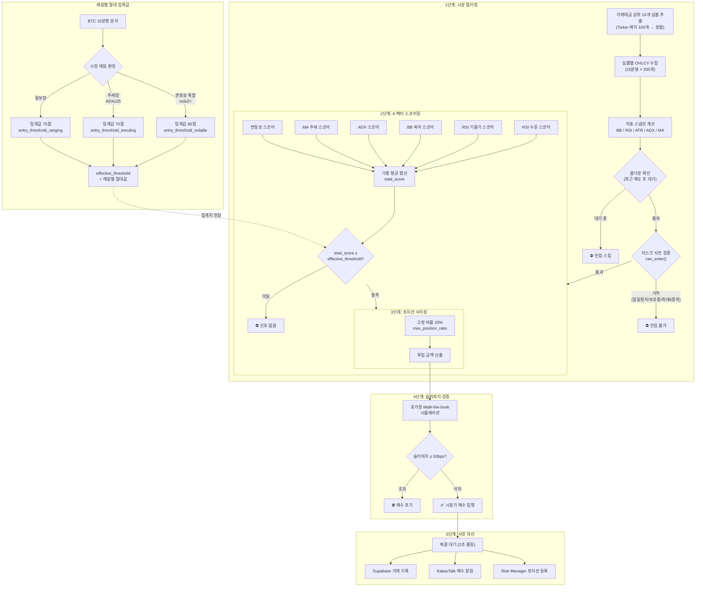
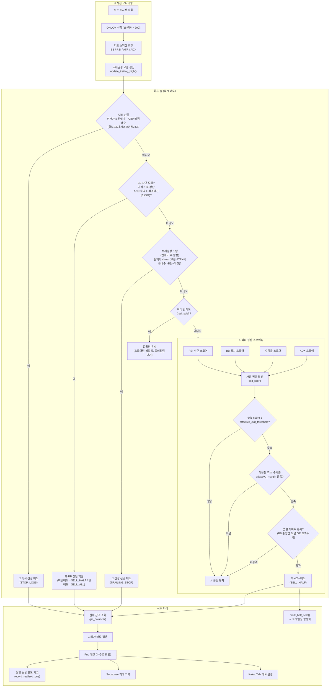

## 핵심 매매 전략: 확증 기반 변동성 조절형 평균 회귀

본 전략은 가격이 통계적 정상 범위를 벗어났을 때 평균으로 회귀하려는 성질을 이용하되, 추세가 완전히 무너지는 상황을 회피하기 위해 '진입 확증'과 '동적 위험 관리'를 결합한 알고리즘입니다.

---

## 1. 진입 알고리즘 (Entry Logic)

가격이 단순히 낮아졌다고 매수하는 것이 아니라, 하락세가 멈추고 반등의 에너지가 모이는 시점을 포착합니다. 기존의 엄격한 필터 방식(AND-gate) 대신, 여러 지표의 상태를 점수화하여 종합적으로 판단하는 **스코어링 시스템**을 사용합니다.

### 1단계: 시장 필터링 (폭풍 전야 감지)

* **거래 대금 상위 추출:** 유동성이 부족한 종목에서 발생하는 가격 왜곡을 피하기 위해 업비트 거래 대금 상위 10개 종목으로 대상을 제한합니다.
* **변동성 과부하 계산:** 최근 4시간의 변동성이 과거 ~2일 평균보다 2배 이상 높을 경우, 시장이 비정상적인 공포 상태라고 판단합니다. 이는 파도가 너무 높을 때 배를 띄우지 않는 것과 같습니다. (15분봉 기준: 단기 16캔들 / 장기 192캔들)
* **레짐별 절대 임계값:** 시장 레짐에 따라 진입 임계값을 직접 지정합니다. 기존 오프셋(+N) 방식 대신, 각 레짐에서 요구하는 스코어를 명시적으로 설정합니다.

| 레짐 | 판정 조건 | 진입 임계값 | 설정 변수 | 근거 |
|------|----------|-----------|----------|------|
| **추세장** (Trending) | BTC ADX ≥ 25 | **70점** | `entry_threshold_trending` | 추세 방향 진입이 유리하므로 가장 낮은 임계값 |
| **횡보장** (Ranging) | 기본 상태 | **75점** | `entry_threshold_ranging` | 평균 회귀 전략의 기본 임계값 |
| **변동성 폭발** (Volatile) | 변동성 비율 ≥ 2배 | **80점** | `entry_threshold_volatile` | 위험이 높으므로 가장 높은 임계값 |

* **레짐 플래핑 방지:** 레짐 판정은 `regime_lookback_candles=2` 다수결로 안정화하며, 안전 모드(추세/변동성) 진입은 즉시 허용하되 해제(→횡보)는 최소 20분(`regime_min_hold_minutes=20`) 유지하여 레짐 전환 잦은 변동(플래핑)을 방지합니다.

### 2단계: 매수 신호 포착 (스코어링 시스템)

진입 신호는 6가지 세부 필터의 점수를 가중 합산하여 결정됩니다. 각 필터는 0~100점 사이의 점수를 산출하며, 최종 합산 점수가 사용자가 설정한 **진입 임계치(Threshold)** 이상일 때 매수 신호가 발생합니다.

#### 스코어링 산출 공식
| 필터 | 100점 (유리) | 0점 (불리) | 스코어 공식 | 가중치 변수 |
|------|-------------|-----------|------------|------------|
| 변동성 | vol_ratio ≤ 1.0 | vol_ratio ≥ 3.0 | `max(0, min(100, (3.0 - ratio) / 2.0 * 100))` | `w_volatility` |
| MA 추세 | MA20 > MA50 | MA20 < MA50 | 상승=100, 하락=0, 데이터부족=50 | `w_ma_trend` |
| ADX | ADX ≤ 15 | ADX ≥ 40 | `max(0, min(100, (40 - adx) / 25 * 100))` | `w_adx` |
| BB 복귀 | 하단 이탈 후 복귀 (3단계 평가) | 이탈 이력 없음 | 3단계: RSI<15→30, MA데드크로스→30, ADX>25∧price<MA50→40, 정상→100, 이탈중=30, 없음=0 | `w_bb_recovery` |
| RSI 기울기 | slope > 3.0 | slope ≤ 0 | `max(0, min(100, slope / 3.0 * 100))` | `w_rsi_slope` |
| RSI 수준 | RSI ≤ 20 | RSI ≥ 45 | `max(0, min(100, (45 - rsi) / 25 * 100))` | `w_rsi_level` |

> **RSI slope 감쇠:** RSI가 15 미만인 극단적 과매도 상태에서는 RSI↗(기울기) 스코어에 ×0.6 감쇠를 적용합니다. 극저 RSI에서의 일시적 반등 기울기는 신뢰도가 낮으므로, 이 구간의 기울기 점수를 하향 조정하여 '떨어지는 칼날 잡기'를 억제합니다.

#### 최종 점수 계산 (Weighted Average)
`total_score = Σ(w_i × score_i) / Σ(w_i)`

* **진입 조건:** `total_score ≥ get_entry_threshold(regime)`
* 레짐별 임계값은 위 '레짐별 절대 임계값' 표 참조. 횡보장 기본값 75점은 15분봉 실운영 튜닝에서 과도한 진입(노이즈 신호)을 줄이면서 거래 기회를 지나치게 잃지 않도록 맞춘 균형값입니다.
* **특징:** 특정 지표가 기준에 약간 미달하더라도 다른 지표가 매우 강력한 신호를 보낸다면 진입이 가능해져, 유연한 대응이 가능합니다.

### 3단계: 포지션 사이징 (고정 비율)
* **고정 비율:** 총 자산의 20%(`max_position_ratio`)를 투입합니다. 최소 주문 금액은 5,000 KRW입니다.
* **Kelly 공식 비활성화:** 실운영에서 과거 거래 기록(승률 44%, 손익비 0.29)의 기대값이 음수여서 모든 매수를 차단하는 문제가 발생하여, Kelly 공식을 비활성화하고 고정 비율 방식으로 전환했습니다.

### 4단계: 슬리피지 검증 (Slippage Check)
* **호가창 시뮬레이션:** 실제 매수 주문을 넣기 직전, 현재 호가창의 잔량을 확인하여 내가 사려는 금액이 가격을 얼마나 밀어올릴지(Slippage) 계산합니다.
* **진입 거부 조건:** 예상 슬리피지가 50bps(0.5%)를 초과할 경우, 진입 신호가 발생했더라도 매매를 포기합니다. 이는 '비싸게 사서 수익률을 깎아먹는' 상황을 방지하기 위함입니다.

### 진입 파이프라인 요약

`시장 레짐 판정(Regime Detection)` → `레짐별 임계값 조회(Threshold Lookup)` → `매수 신호 발생(Signal)` → `고정비율 사이징(Fixed Ratio)` → `슬리피지 검증(Slippage Check)` → `시장가 매수 집행(Buy Market)`

---

## 2. 청산 알고리즘 (Exit Logic)

수익을 지키고 손실을 최소화하기 위해 수학적 계산에 기반하여 기계적으로 매도합니다.

### 설계 목표 (안정적 수익 극대화)

* **손익비 우선:** 잦은 소액 익절/손절보다, 평균 손실 대비 평균 이익을 크게 만드는 방향으로 청산 품질을 높입니다.
* **조기 청산 억제:** 스코어가 잠깐 높아졌다는 이유만으로 너무 빨리 팔지 않도록, 평균 복귀 확인과 적응형 최소 수익률을 함께 사용합니다.
* **수익 잠금 강화:** 1차 익절 후 잔량은 트레일링으로 추세 이익을 추적하되, 본전+마진 보호선을 적용해 확보한 수익이 역전되지 않게 합니다.

### 1단계: 동적 손절 (위험 구간 탈출)

* **시장 호흡 기반 손절(ATR 활용):** 고정된 -3% 손절 대신, 최근 시장의 평균적인 흔들림 폭(ATR)을 계산하고, 시장 레짐에 따라 차등 배수(횡보=2.8배, 추세=2.2배, 변동성=2.5배)를 적용하여 그 이상 가격이 떨어지면 즉시 매도합니다.
* **비유:** 시장이 평소보다 거칠게 숨을 쉰다면 손절 범위를 넓게 잡고, 시장이 조용하다면 좁게 잡아 불필요한 손절을 방지하는 '유연한 방어막'입니다.

### 2단계: BB 상단 도달 익절 (하드 룰)

* **즉시 매도 조건:** 현재 가격이 볼린저 밴드 상단(BB Upper) 이상이고, 최소 수익 마진(`min_profit_margin`, 기본 0.45%)을 충족하면 스코어링·품질 게이트를 거치지 않고 즉시 매도합니다.
* **분할 매도:** 1차 익절 전이면 `SELL_HALF`(40%), 이미 1차 익절을 했으면 `SELL_ALL`(잔량 전량)을 실행합니다.
* **설계 이유:** BB 상단 도달은 가격이 통계적 상단 범위에 진입했음을 의미하며, 평균 회귀 전략에서 자연스러운 익절 지점입니다. 스코어링 임계치, 품질 게이트, 적응형 마진을 모두 우회하여 확실한 수익 실현 기회를 놓치지 않습니다.

### 3단계: 트레일링 기반 이익 잠금 (잔량 관리)

* **레짐/수익률 적응형 트레일링 배수:** 기본 `2.4`를 기준으로 레짐(추세/변동성/횡보)과 누적 수익률에 따라 배수를 자동 보정합니다.
* **손익 보호 바닥가:** 트레일링 스탑 계산값이 너무 낮아지더라도 `entry_price × (1 + min_profit_margin)` 아래로는 내려가지 않도록 보호선을 둡니다.
* **목적:** 추세 구간에서는 이익을 더 오래 추적하고, 반전 구간에서는 확보한 수익을 기계적으로 잠급니다.

### 4단계: 분할 익절 (스코어링 기반)

* **1차 익절(기본 40%):** 청산 스코어가 임계치를 넘더라도 아래 품질 게이트를 통과해야 분할 익절을 실행합니다.
  * 적응형 최소 수익률 충족: `profit_pct ≥ max(min_profit_margin, ATR/entry × 0.8, 상한 1.2%)`
  * 추가 품질 게이트: `가격 ≥ BB 중앙선` **또는** `profit_pct ≥ 적응형 최소수익률 × 1.8`
* **2차 익절(잔량):** 1차 익절 이후에는 스코어링 기반 매도를 비활성화하고, 하드 룰(동적 손절 + BB 상단 익절 + 트레일링)로만 종료합니다.

> **1차 익절 후 스코어링 매도 비활성화:** 1차 익절(기본 40%)이 실행된 후에는 스코어링 기반 매도를 건너뛰고, 오직 하드 룰(동적 손절 + BB 상단 익절 + 트레일링 스탑)만 작동합니다. 이는 스코어링 매도가 트레일링 스탑보다 먼저 발동하여 추가 수익 기회를 차단하는 문제를 해결합니다.

### 청산 파이프라인 요약

---

## 3. 리스크 관리 규정

* **자산 배분:** 켈리 공식(Kelly Criterion)에 따라 동적으로 비중을 조절하며, 한 종목당 최대 20%를 초과하지 않습니다.
* **동시 운용 제한:** 최대 5개 종목까지만 동시에 매매를 수행하여 리스크를 분산합니다.
* **일일 손실 한도:** 하루 전체 자산 대비 5% 이상의 손실이 발생하면 해당 날의 모든 자동 매매 로직을 강제 종료합니다.

---

## 4. 전략 수식

* **볼린저 밴드 하단:** 
* **동적 손절가:** 
* **RSI 과매도 기준:**
