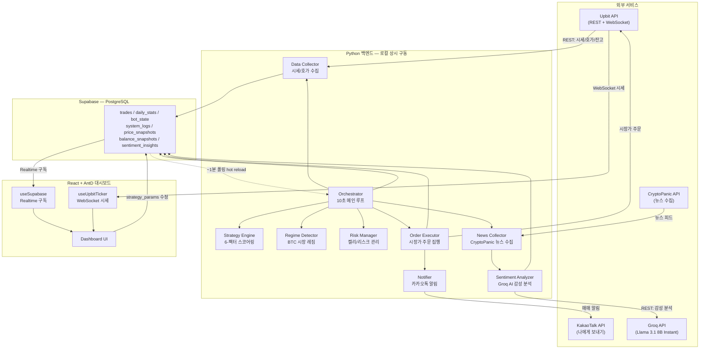
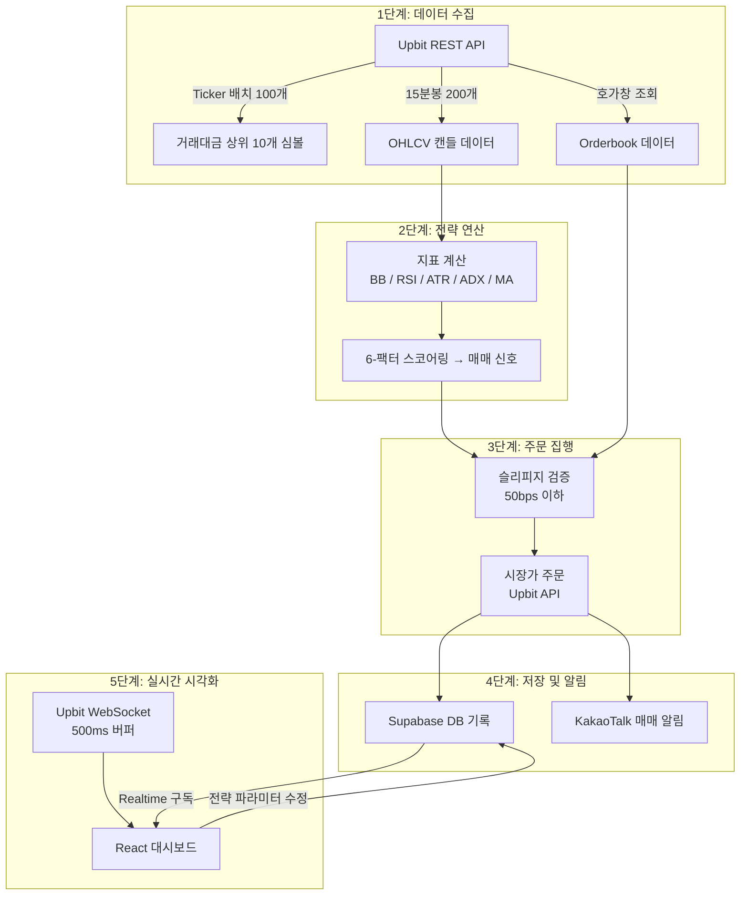

# 시스템 아키텍처 설계서 (System Architecture Design)
**버전:** 1.1 (AntD UI 반영)
**작성일:** 2026-02-21

## 1. 시스템 개요
본 시스템은 업비트 API를 통해 데이터를 수집하고, Supabase를 데이터베이스로 활용하며, React와 AntD 기반의 대시보드로 현황을 모니터링하는 로컬 구동형 자동 매매 시스템입니다.

## 2. 기술 스택
- **Language:** Python 3.10+, JavaScript/TypeScript (React)
- **Frontend UI:** Ant Design (AntD)
- **Database:** Supabase (PostgreSQL)
- **Exchange API:** Upbit API
- **Notification:** KakaoTalk Messaging API
- **Deployment:** Local PC (Always-on)

## 3. 계층별 구조
### 3.1 데이터 수집부 (Data Collector)
- **Upbit API Interface:** REST API 및 WebSocket을 통한 실시간 데이터 수집.
- **Slippage Estimator:** 호가창 데이터를 분석하여 시장가 주문 시 예상 체결 가격(Slippage)을 산출.
- **News Collector (`collector/news_collector.py`):** CryptoPanic API v1에서 암호화폐 관련 뉴스를 주기적으로 수집 (약 5분 간격). 중복 방지를 위한 seen_ids 관리.

### 3.2 전략 연산부 (Strategy Engine)
- **Mean Reversion Logic:** 볼린저 밴드 및 RSI 기반 알고리즘 연산.
- **Market Regime Detector (`strategy/regime.py`):** BTC-KRW 기반 시장 레짐 감지 (trending/ranging/volatile). 2분마다 판단하여 orchestrator에서 진입 필터로 사용.
- **Risk Manager (`risk/manager.py`):** 켈리 공식(Kelly Criterion)을 활용한 동적 포지션 사이징 및 진입 전 슬리피지 임계치 검증.
- **Sentiment Analyzer (`strategy/sentiment.py`):** Groq API (Llama 3.1 8B Instant)를 활용한 뉴스 감성 분석. CryptoPanic에서 수집한 뉴스 제목을 AI로 분석하여 bullish/bearish/neutral 판정 및 BUY/SELL/HOLD/WAIT 의사결정 생성.

### 3.3 주문 및 알림부 (Action Layer)
- **Order Executor:** 매매 주문 집행 및 KakaoTalk 알림 전송.

### 3.4 대시보드 UI (Frontend Layer) - *추가*
- **Monitoring Web:** React 및 AntD를 활용하여 자산 현황, 매매 로그, 전략 적합도를 시각화.

### 3.5 데이터 저장부 (Storage Layer)
- **Supabase DB:** 매매 기록, 일별 손익, 시스템 로그 영구 저장.

## 4. 데이터 흐름

### 4.1 시스템 아키텍처 개요

아래 다이어그램은 전체 시스템의 구성 요소와 데이터 흐름을 보여줍니다.

### 4.2 데이터 흐름 상세

수집 → 연산 → 집행 → 저장 → 시각화의 5단계 파이프라인을 거칩니다.

### 4.3 흐름 요약

1. **[Upbit]** → 시세 데이터 수집 → **[Python Engine]**
2. **[Python Engine]** → 전략 연산 → 매매 신호 생성
3. **[Python Engine]** → **[Risk Manager]** 켈리 비중 산출 및 슬리피지 검증
4. **[Python Engine]** → **[Upbit]** 주문 전송 & **[Supabase]** 기록 저장
5. **[Supabase]** → **[React/AntD Dashboard]** 실시간 데이터 시각화 (Realtime 구독)
6. **[Upbit WebSocket]** → **[React Dashboard]** 실시간 시세 수신 (500ms 버퍼)
7. **[React Dashboard]** → **[Supabase]** 전략 파라미터 수정 → **[Python Engine]** ~1분 폴링 반영
8. **[Python Engine]** → **[KakaoTalk]** 매매 결과 알림 전송
9. **[CryptoPanic]** → 뉴스 수집 → **[Groq API (Llama 3.1 8B)]** 감성 분석 → **[Supabase]** 결과 저장 → **[React Dashboard]** Realtime 구독으로 표시